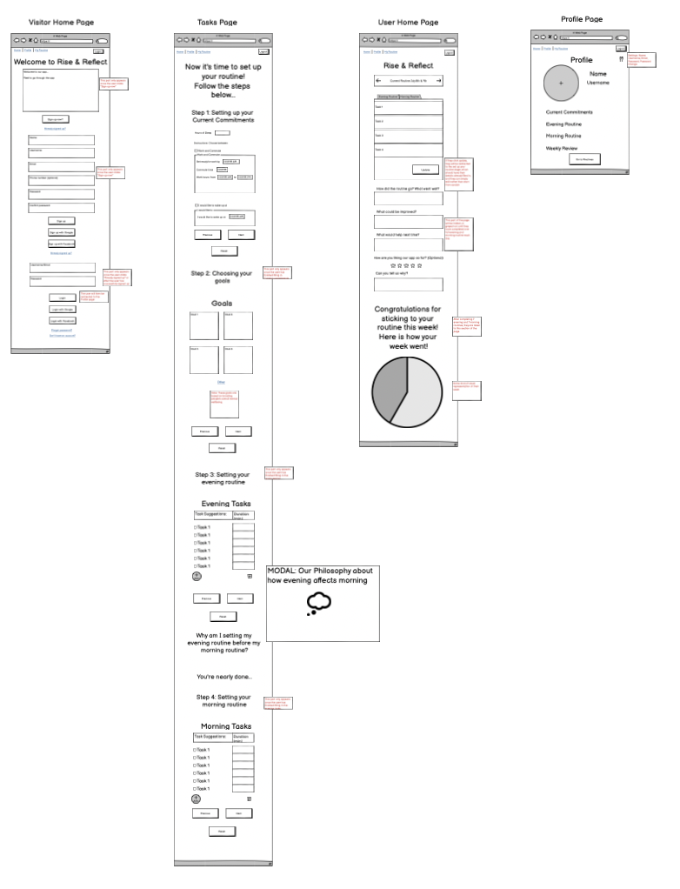
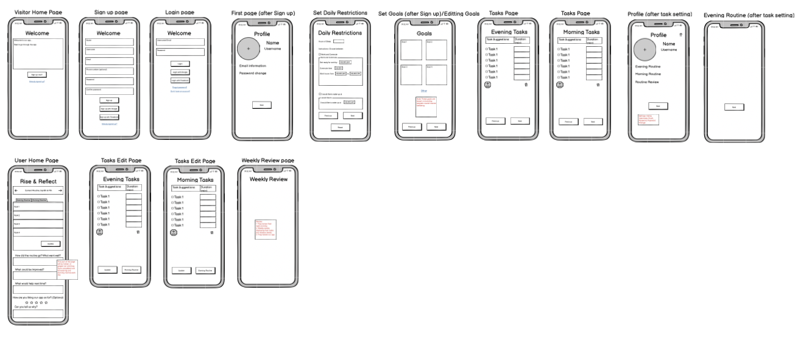
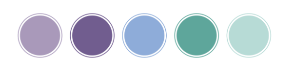

# Rise & Reflect

[Click here to view the live web application](LIVE LINK HERE)

### Hello and Welcome!

This is the documentation for our mental health website: Rise & Reflect, which forms part of the Hays & Super Connect 2023 annual Hackathon competition! Rise & Reflect is a revolutionary morning and evening routine website designed to enhance your mental wellbeing and awareness! With its user-friendly interface, Rise & Reflect guides you through personalized routines and tasks crafted by our team. While many may think that working on your morning routine first will kickstart your day, we believe that your evening routine is even more important. A calming, productive evening routine not only eases off a stressful day, it also influences how you start your morning the next day, which in turn affects the rest of the day. 

Use our app to create your ideal evening and morning routine, track your progress and most importantly, improve your overall mental wellbeing and productivity. Embrace a happier and healthier lifestyle as you nurture your mind and unlock your full potential. Start your journey to Rise & Reflect today!

Please use the table of contents below to navigate through all of the planning, features, deployment, testing and more!

## Table of Contents

1. [Project Development and Planning](#project-development-and-planning)
    - [Project Goals](#project-goals)
        - [Project Purpose](#project-purpose)
        - [Target Audience](#target-audience)
    - [Research](#research)
        - [Market Review](#market-review)
        - [Key Takeaways](#key-takeaways-from-market-review)
    - [User Stories](#user-stories)
    - [Design, Layout and Structure](#design-layout-and-structure)
        - [Wireframes](#wireframes)
        - [Structure and Layout](#structure-and-layout)
        - [Design and Colour](#design-and-colour)
        - [Font](#font)
2. [Technologies Used](#technologies-used)
    - [Languages](#languages)
    - [Frameworks](#frameworks)
    - [Tools](#tools)
3. [Features](#features)
    - [Whole Site](#whole-site)
        - [Favicon](#favicon)
        - [Footer](#footer)
    - [Welcome Section](#welcome-section)
    - [Quiz Section](#quiz-section)
        - [Progress Bar](#progress-bar)
        - [Questions and Options](#questions-and-options)
    - [Results Section](#results-section)
        - [Supervillian Personality Reveal](#supervillain-personality-reveal)
        - [Retake Quiz Button](#retake-quiz-button)
        - [Return Home Button](#return-home-button)
    - [Other Pages](#other-pages)
        - [404 page](#404-page)
    - [Future Features](#future-features)
4. [Testing](#testing)
    - [Automated Testing](#automated-testing)
        - [HTML Validator Testing](#html-validator-testing)
        - [CSS Validator Testing](#css-validator-testing)
        - [JS Validator Testing](#js-validator-testing)
        - [Accessibility](#accessibility)
        - [Performance](#performance)
    - [Manual Testing](#manual-testing)
        - [Responsiveness / Device Testing](#responsiveness-/-device-testing)
        - [Browser Compatibility](#browser-compatibility)
        - [Solved Bugs](#solved-bugs)
        - [Testing User Stories](#testing-user-stories)
5. [Deployment](#deployment)
6. [Credits](#credits)

## Project Development and Planning 

### Project Goals 

#### Project Purpose

Rise & Reflect was planned and developed using principles of User Experience (UX) design, which include the five planes of Strategy, Scope, Structure, Skeleton, and Surface. Using these principles, the aim was to create a fun, easy-to-use, responsive, and engaging website that allows users to create a productive, calming evening and morning routine to suit their mental health needs.

#### Target Audience

Despite this being built for a hackathon competition, Rise & Reflect was still treated as a real-world application for potential clients interested in improving their overall mental wellbeing, and creating a structured routine to improve other skills, like time management. 

Therefore, this website is designed for users of any background or age, but will most likely gain more interest from users interested in creating a routine or seeking to improve their mental health. The simplicity of the website makes it easy for adults, teenagers and even children to take, and retake, the quiz as many times as they want, and access the results each time. 

### Research 

#### Market Review 

Before designing the website, our team reviewed other mental health websites (see below), in order to get a feel of how they presented themselves, which content and features they offered, and the design choices they made in terms of colour palette. We also reviewed what appeared to work well for the user and what needed improvements (see Key Takeaways). 

[BetterHelp](https://www.betterhelp.com) | [Calm](https://www.calm.com) | [Headspace](https://www.headspace.com) | [The Mighty](https://themighty.com) | [Truity Big Five Personality Test](https://www.truity.com/test/big-five-personality-test)

#### Key Takeaways

- The website should be have lighter colors to create a calming environment for the user
- The Website should be clean, simple, and easy to navigate
- The sign up and login should be simple and easy
- The welcome page should not be too busy, as this will create the opposite effect on the user

### User Stories

As a first-time user, I would like to:
- Sign up quickly and easily
- Add and edit tasks for my evening and morning routine quickly and easily
- Navigate easily through the site

As a returning user, I would like to:
- Login quickly and easily
- View and edit my current evening or morning routine
- View my progress on the Profile page
- Navigate easily through the site
- Access an affordable platform that can help me deal with mental health stressors

These user stories gave our team a clear scope for the website and enabled us to stay on track with the project, preventing issues like scope creep at a later stage after the coding process. 

### Design, Layout and Structure 

#### Wireframes

We used [Balsamiq](https://balsamiq.com/) in the initial design phase, before the coding process. This enabled us to develop the website's structure, skeleton, layout and overall look and style. Our team created designs for desktop, tablet and mobile screens to ensure that responsiveness was at the forefront of the application from the beginning.

Screenshots

_Desktop Wireframes_

_Phone Wireframes_

#### Structure and Layout

The structure of this website was informed by the scope, principles of interactive design (IXD), as well as the user goals of the website. Keeping these important concepts in mind ensured that the website conformed to the user's expectations and needs. 

The main site is a simple, multi-page website with content displayed and hidden at different points in the quiz using Django. There are three main sections within the page which appear and disappear depending on where you are in the site. These are:

- Welcome, Sign Up and Sign In Area: 
    - A brief introduction to the site, which allows the user to sign up or login if they are a returning user.
- Routine Area: 
    - The main routine area, which allows users to Create, Read, Update and Delete tasks, using the CRUD functionality.
- Profile Page: 
    - The user can see a summary of their routines, as well as review their progress
    - The user can access their login information, and reset their password if necessary

#### Design and Colour

This site was designed for all screen sizes, and after conducting some research (using sites like [Adobe](https://xd.adobe.com/ideas/process/ui-design/what-is-mobile-first-design/)), it appears that most users use their mobile devices over desktop or iPad screens. 

- The design was influenced by calming colours like light purples, blues and greens which create a calming effect for the user. 
- The welcome page has images of people engaging in morning and evening routines.
- The same colours were used for all buttons and headings, to maintain consistency throughout the site. 

Screenshots

_Colour Palette for entire website_

#### Font

Our choice of font was Comfortaa. The light font style was used for all paragraphs and and the bold font was used for all headings and buttons. This font choice was imported from [Google Fonts](https://fonts.google.com/) and had a backup font of Cursive. We chose this font for my website because the cursive style contributed to the calming theme, whilst also providing a professional, legible finish.

## Technologies Used 

This website was developed using the frameworks of Django and Bootstrap 4, as well as some web tools for the initial planning. A list of those included in the project can be seen as follows: 

### Frameworks
- [Django](https://en.wikipedia.org/wiki/Django)
- [Bootstrap](https://en.wikipedia.org/wiki/Bootstrap)

### Languages 
- [HTML5](https://en.wikipedia.org/wiki/HTML5)
- [CSS3](https://en.wikipedia.org/wiki/Cascading_Style_Sheets)
- [JavaScript](https://en.wikipedia.org/wiki/JavaScript)
- [Python](https://en.wikipedia.org/wiki/Python)

### Tools 
- [Git](https://git-scm.com/)
    - Git was used for version control via GitPod, by using the terminal to Git and Push to GitHub.
- [GitHub](https://github.com/)
    - GitHub was used to store the project code after being created in GitPod/Git.
- [Gitpod](https://www.gitpod.io/)
    - Gitpod was used to create, edit and preview the project's code.
- [Balsamiq](https://balsamiq.com/)
     - Balsamiq was used to create wireframes during the initial design process.
- [Google Fonts](https://fonts.google.com/)
    - Google Fonts was used to select and import the fonts to the project (Libre Baskerville and Libre Baskerville Bold).
- [Font Awesome](https://fontawesome.com/)
    - Font Awesome was used to add icons to the site to help with UX and to add more character to the project visually.
- [Tiny PNG](https://tinypng.com/)
    - Used to further optimise the images for the site and reduce file size.
- [Adobe Illustrator](https://www.adobe.com/uk/products/illustrator.html) and [Adobe Color] (https://color.adobe.com/create/color-wheel)
    - These were used to create the colour pallette as well as ideas for the initial design.
- [Favicon.io](https://favicon.io/favicon-converter/)
    - Used to create and add the favicon to the browser tab.

## Features

### Whole Site

#### Favicon

We included a Favicon for the site using the an R&R graphic which had the same colours as the site's design. This helped to build the brand and continue the site design in the user's browser tab.

Screenshots

_Favicon_

#### Footer 

- The footer contains links to relevant social media sites.
- The footer social icons have aria labels to improve accessibility.
- The footer social icons have a hover effect with a smooth colour transition.
- The footer is responsive on all screen sizes.

Screenshots

_Footer on Desktop_

_Footer on iPad_

_Footer on Phone_

_Hover effect on social links_

### Welcome Section

This section contains the following features:

- A brief introduction and information about the quiz, how it works and some persuasion for the user to take it.
- The layout is responsive on all devices, with margins widening on larger devices.
- The semi-circles with the supervillain images in this section expand to full squares on larger screens. This is because the expansion of the semi-circles did not contain the images well on larger screens.
- Name input section:
    - User must enter a name to start the quiz - An alert div box appears below the input field if the user tries to take the quiz without entering their name.
    - The input field only accepts names with or without spaces, to prevent users from filling in numbers or characters. 
    - The name limits the number of characters to a minimum of 2 and a maximum of 15.
- Take Quiz button 
    - Launches the quiz
    - Has a hover effect which enlarges the button on non-touchscreen devices, so users know that they can click the button.

Screenshots

_Welcome section on Desktop_

_Welcome section on iPad_

_Welcome section on Phone_

_Name Input and Take Quiz button_

_Alert div box_

### Quiz Section

The quiz section is fully responsive with the answers increasing in font size and expanding in width on larger devices. I used [Adobe Illustrator](https://www.adobe.com/products/illustrator.html) to choose the shade of green for the option buttons. This colour was selected because it was matched as a complimentary colour to the shade of red (#880808) chosen as the background. 

Screenshots

_Quiz section on Desktop_

_Quiz section on iPad_

_Quiz section on Phone_

#### Progress Bar

- Gives the user an indication of where they are in the quiz and how many questions are left.
- Contains both a visual reference in the length of the colour bar and a number reference in the question number.
- Updates when a user selects an answer and the question is repopulated.

Screenshots

_Progress Bar Design_

#### Questions & Options

- Displays the question with four options, and updates with the next question and a set of options each time the user makes a selection.
- Has a different colour hover effect on the answers on non touchscreen devices with a smooth transition.
- Once the user has chosen an option, they are immediately taken to the next question, to keep them engaged and interested. This is all part of creating an intuitive and positive user experience.
- A separate 'next question' button was excluded from the options, as it adds an extra click for the user which they may find irritating.

Screenshots

_Questions and options section_

_Answer hover effect_

### Results Section

#### Supervillian Personality Reveal

- This section gives detailed information about the user's supervillain personality match.
- The total score calculated once the user has answered all 10 questions is calculated and matched with one of eight possible supervillains (see the list above).
- The result includes a picture of the supervillain chosen, as well as information about the personality type associated with that supervillain match.
- The supervillain personality results are fully responsive, expanding in size on larger screens.

Screenshots

_Results section on Desktop_

_Results section on iPad_

_Results section on Phone_

#### Retake Quiz Button

- This button is displayed below the results section and allows the user to restart the quiz.
- It has the same design, colour and hover effect as the Take Quiz button, to maintain consistency throughout the quiz. 
- It is only displayed in the results section once the user has finished taking the quiz, to prevent the user from accidentally restarting the quiz when they have not yet completed all of the questions.

Screenshots

_Retake Quiz Button_

#### Return Home Button

- This button is displayed below the results section and allows the user to return to the welcome section if they wish so.
- It has the same design, colour and hover effect as the Go Home Button on the 404 page, to maintain consistency throughout the quiz.
- The colour is purposefully different to the Retake Quiz button, to avoid the user accidentally pressing the wrong button.

Screenshots

_Return Home Button_

### 404 Page

- The 404 page was set up to smoothly handle user's who have ended up on a non-existent part of the site.
- This page provides a positive emotional response to the user and a better user experience.
- It has the same design as the rest of the site, so the users don't feel like they have left the site, encouraging them to return to the home page.
- The design, colour and text all match the supervillain theme of the quiz in order to maintain consistency.
- The Go Home button takes the user back to the home page so there is no need for the user to use the browser back button.

Screenshots

_404 Page on Desktop_

_404 Page on iPad_

_404 Page on Phone_

## Future Features 

I would like to add additional features to expand the site. This unfortunately fell out of the scope of this project, but would be useful to users in the future. 

#### User Log In Account and Sign Up Page

This would give the user the ability to save their results and recommendations, creating a secure account and log in so that they can re-access their data.

#### Additional Personality Quizzes

As was mentioned previously, this quiz is a simple design, but would ideally be part of a larger, more complex quiz website. Therefore, for future features, I would like to add:
- Different types of personality quizzes, so the user can learn about their personality in a variety of different contexts.
- Add a navigation bar that would help the user navigate through the different quizzes.
- Add more detailed information, backed by psychological research, about the different personality types in the quiz results sections.

## Testing

### Automated Testing

#### HTML Validator Testing 

I ran my HTML code for each page through the [W3C HTML Validator](https://validator.w3.org/). Thankfully, no errors were displayed. There were some minor warnings, due to the use of multiple h1 elements, but once this was resolved, the results came back clean. 

Screenshots

_HTML Validator Warnings_

_HTML Validator Result_

#### CSS Validator Testing

I ran my CSS code through the [W3C CSS Validator](https://jigsaw.w3.org/css-validator/). No errors were displayed, however there were two warnings shown regarding the use of vendor extended pseudo elements (see screenshot). This was kept in the file despite the warnings, as it was the only way to access the progress bar for styling. 

Screenshots

_CSS Validator Warning_

_CSS Validator Results_

#### JavaScript Validator Testing

I ran my JavaScript code through [Jshint validator](https://jshint.com/). The only warnings shown initially were to use "-moz" instead of "let" for global variables. However, once I configured the settings to support "New JavaScript Features (ES6)" there were no further warnings or errors. 

Screenshots

_JS Validator Result_

_Change of configuration_

#### Accessibility

I tested accessibility of the website using Google Chrome Dev Tools Lighthouse, and the scores came out clean. I also ran the site through the [Wave Web Accessibility Evaulation Tool](https://wave.webaim.org/). No warnings or errors were shown. 

Screenshots

_Accessibility result on Lighthouse_

_Accessibility result on Wave_

#### Performance

I tested the site's performance through Google Chrome Dev Tools Lighthouse. Thankfully, the performance, accessibility, SEO and best practices all produced good scores. 

Screenshots

_Performance, accessibility, SEO and best practices result_

### Manual Testing

#### Testing User Stories

I ran manual tests on the website, based on the user stories mentioned above:

| No. | User Goal | How is it achieved? |
| :--- | :--- | :--- |
| 1 | I want to take part in a fun and interesting quiz and learn more about my personality | The quiz is an engaging, online game which gives people an insight into their personality and how they would match with a supervillain. It has been designed to have limited questions to keep the user interested, and creates fun, unusual scenarios for the user to choose from. |
| 2 | I want to find out what the quiz is about and what to expect before starting the quiz | The welcome section contains information about what the quiz is about, and is designed with the supervillain theme in mind so the user knows what to expect from the beginning. |
| 3 | I want to learn more about why I was matched with a specific Supervillain at the end of the quiz | The personality results are detailed with a picture of the matched supervillain, as well as a clear description of their personality based on their choices. |
| 4 | I want to access the quiz on any device | The quiz has been designed to be fully responsive across desktop, tablet and mobile devices and has been extensively tested on each. |
| 5 | I want to navigate easily through the quiz questions | The site has a linear navigation where you follow the quiz through to the end with minimal clicks required to submit answers. |
| 6 | I want to sign up with my name quickly and easily | The site has a simple name-input section which allows the user the enter their name, and upon submission, the quiz will start immediately. |
| 7 | I want to have the option of retaking the quiz if I don't like the result | The site has a retake quiz button below the results, once the user has completed the quiz, to give them the option of taking the quiz again. |

#### Browser Compatibility

The site was tested on the following browsers, with no browser-specific bugs detected. 

- Google Chrome
- Mozilla Firefox
- Apple Safari

#### Responsiveness/Device Testing

The website was tested on the following devices:
- HP Display 27-inch External Monitor
- Apple Macbook Pro 13-inch
- Galaxy S9+
- Apple iPhone 12 Pro
- Apple iPhone SE
- Apple iPad mini
- Apple iPad
- Galaxy Tablet
- Google Chrome Developer Tools - using responsive testing for all screen sizes

The website functioned as expected on all devices.

### Solved Bugs

#### All results were displayed at once

When the user retakes the quiz, all of the results were displaying at the same time, rather than just one. This was an issue with the displaying results function in the JavaScript code: The "hide" class was not being re-added to the unwanted results in the function. Once this was added, the results functioned as expected:

Screenshots

_Results bug_

_Results fixed_

#### Retake Quiz button not working

When the user clicked the retake quiz button, the user was taken to question 10 of 10, instead of question 1 of 10. This is because the score and progress bar were not reset to 0, so the questions were not reset to the beginning. To fix this, I reset the score and progress bar to 0 and the quiz worked as expected again.

Screenshots

_Quiz page shown after user clicked the retake quiz button_

_Quiz page shown after bug was fixed_

## Deployment

### GitHub Pages

The site was deployed to GitHub pages. The steps to deploy are as follows: 
1. In the GitHub repository, navigate to the Settings tab.
2. From the left hand menu select 'Pages'.
3. From the source select Branch: main.
4. Click 'Save'.
5. A live link will be displayed when published successfully. 

The live link can be found here: [The Ultimate Supervillain Personality Quiz](https://pecheylauren02.github.io/mp2-supervillain-personality-quiz/)

### Forking the GitHub Repository

You can fork the repository by following these steps:
1. Go to the GitHub repository.
1. Click on Fork button in upper right hand corner.

### Cloning the GitHub Repository

You can clone the repository to use locally by following these steps:
1. Navigate to the GitHub Repository you want to clone.
2. Click on the code drop down button.
3. Click on HTTPS.
4. Copy the repository link to the clipboard.
5. Open your IDE of choice (git must be installed for the next steps).
6. Type git clone copied-git-url into the IDE terminal.

The project will now be cloned locally for you to use.

## Credits

### Design and Planning

- [Adobe Color](https://color.adobe.com/create/color-wheel) helped in developing the colour palette for the initial design phase of the website.

### Code

- [W3C Schools](https://www.w3schools.com/jsref/dom_obj_event.asp) helped in providing a list to all DOM elements and how to manipulate them.
- [StackOverflow](https://stackoverflow.com/) helped with offering solutions on how to debug css and javascript code for certain functions.
- [W3C Schools](https://www.w3schools.com/w3css/w3css_progressbar.asp) helped in initial structure and styling of progress bar.
- [JS Docs](https://jsdoc.app/about-getting-started.html) helped in naming the variables correctly in the javascript files.

### Supervillain Images

- [Lord Voldemort](https://www.wallpaperbetter.com/en/hd-wallpaper-weflb/download/1920x1080)
- [Magneto](https://learn.codeinstitute.net/dashboard)
- [The Joker](https://www.wallpaperbetter.com/en/hd-wallpaper-shryv/download/1366x768)
- [Joker Logo](https://icons8.com/icons/set/joker)
- [The Green Goblin](https://www.wallpaperbetter.com/en/hd-wallpaper-peptw/download/1366x768)
- [Thanos](https://www.wallpaperbetter.com/en/hd-wallpaper-sormx)
- [Vecna](https://www.nawpic.com/vecna-10/)
- [Maleficent](https://www.wallpaperbetter.com/en/hd-wallpaper-swlee/download/1366x768)
- [Maleficent on Welcome page](https://www.wallpaperbetter.com/en/hd-wallpaper-cwcsi)
- [Cruella](https://www.wallpaperbetter.com/en/hd-wallpaper-wfnbu/download/1366x768)

### Acknowledgements

- My mentor, Rohit Sharma, for all of his help and advice throughout the project.
- The whole team at [Code Institute](https://codeinstitute.net/) for their teaching and support.

